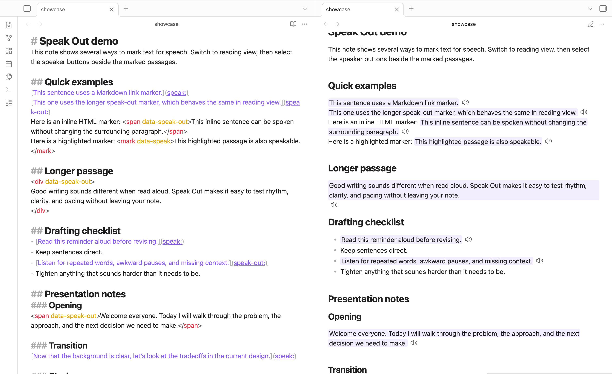
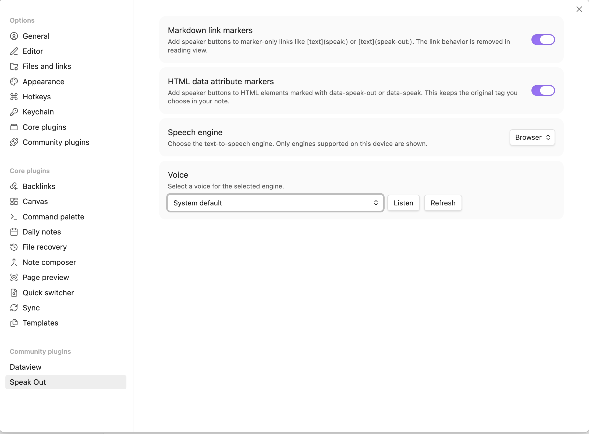

# Speak Out

Speak Out adds lightweight text-to-speech controls to Obsidian reading view. Mark the parts of a note that should be speakable, switch to reading view, and select the speaker button beside the marked content.

The plugin is designed for local, note-level playback. It does not send note content to a remote service, and it uses the text-to-speech support exposed by Obsidian's browser environment.

## Overview

Speak Out separates authoring from playback:

- In source view, you mark the Markdown or HTML content that should be available for speech.
- In reading view, Speak Out detects those markers and adds an icon-only speaker button beside each marked section.
- When selected, the button speaks the rendered text using the configured speech engine and voice.

This keeps the note readable as normal Markdown while making selected passages easy to hear on demand.

## Marking speakable text

Speak Out supports two marker styles. Both are enabled by default, and either can be turned off in settings as long as at least one marker type remains enabled.

### HTML data attributes

Use `data-speak-out` on an HTML element when you want explicit, stable markup:

```html
<span data-speak-out>This sentence can be spoken from reading view.</span>
```

The shorter `data-speak` attribute is also supported:

```html
<mark data-speak>This highlighted sentence can also be spoken.</mark>
```

You can choose the HTML tag that best matches the content. `span` works well for inline text, `mark` works well for highlighted text, and block elements such as `div` work for longer sections.

Add a standard `lang` attribute when a marked HTML element should use a specific language with the system default voice:

```html
<span data-speak-out lang="fr-FR">Bonjour tout le monde.</span>
```

If `lang` is missing, Speak Out uses the default language setting. If both are empty, the system chooses automatically. The `lang` attribute is ignored when you choose a specific voice because that voice controls its own language.

### Markdown link markers

Use a marker-only Markdown link when you want quick inline markup:

```markdown
[This sentence can be spoken from reading view.](speak:)
[This sentence can also be spoken.](speak-out:)
[Bonjour tout le monde.](speak:fr-FR)
```

Add a language after `speak:` or `speak-out:` when the link text should use a specific language with the system default voice. In reading view, Speak Out removes the link behavior from these markers and treats the link text as speakable content.

## Playback

Speak Out adds a speaker button directly after each marked section in reading view. Selecting the button speaks the text from that section.

Starting a new speech request stops the previous one. If speech synthesis is not available in the current Obsidian environment, Speak Out shows a notice instead of attempting playback.

## Settings

Speak Out adds a settings tab with controls for marker handling and speech output:

- **Markdown link markers**: Enable marker-only links such as `[text](speak:)`, `[text](speak-out:)`, and `[text](speak:fr-FR)`.
- **HTML data attribute markers**: Enable HTML elements marked with `data-speak-out` or `data-speak`.
- **Speech engine**: Choose from supported text-to-speech engines on the current device.
- **Default language**: Choose the language used when **Voice** is set to **System default** and marked content has no `lang` attribute, or choose **System default** to let the system decide.
- **Voice**: Choose a voice for the selected engine, or use the system default.
- **Listen**: Preview the selected voice.
- **Refresh**: Reload the available voice list.

The available engines and voices depend on Obsidian, the operating system, installed voices, and device settings.

## Preview

**Source Code and Reading View**


**Settings**


## Privacy

Speak Out does not make network requests and does not transmit note content. Playback is handled by the selected text-to-speech engine available through Obsidian's browser runtime.

Speech processing behavior may vary by platform. Some operating systems or browser environments may provide local voices, cloud-backed voices, or a mix of both. Review your device's speech and accessibility settings if you need to confirm how a specific voice is handled.

## Limitations

- Speak Out adds controls in reading view, not source view.
- Text-to-speech support depends on Obsidian's browser environment.
- Voice availability varies by platform and device.
- Mobile behavior depends on the text-to-speech support available on iOS or Android.

## Development

Install dependencies:

```bash
npm install
```

Start a development build in watch mode:

```bash
npm run dev
```

Create a production build:

```bash
npm run build
```

Run linting:

```bash
npm run lint
```

Source code lives in `src/`. Obsidian loads the bundled `main.js` from the plugin root.

## License

BSD-3-Clause
